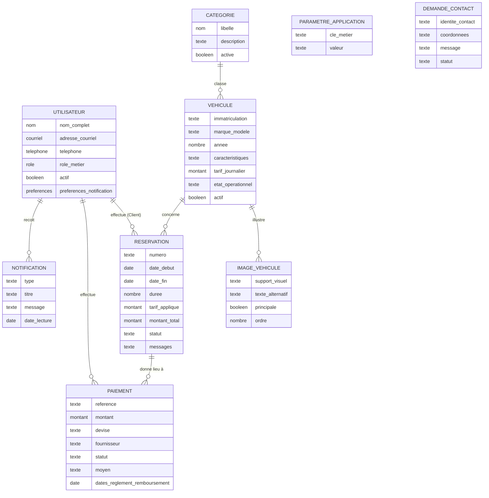
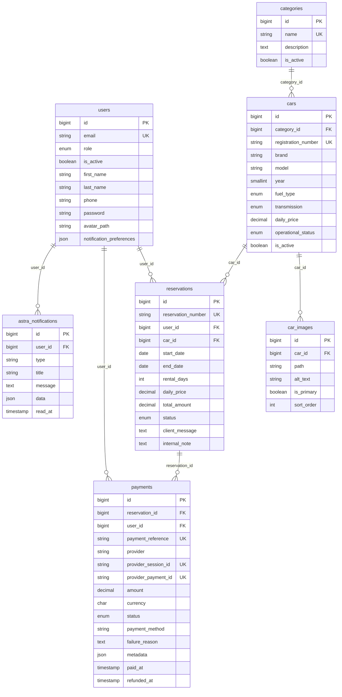

# ASTRA PFA — Preuves finales du MCD et du MLD

## 1. Périmètre de vérification

Le modèle ci-dessous est reconstruit à partir des migrations, des modèles Eloquent et des règles métier actuellement présentes. Les tables internes à Laravel ne sont pas assimilées à des entités métier.

**Sources principales :**

- `backend/database/migrations/0001_01_01_000000_create_users_table.php` ;
- `backend/database/migrations/2026_08_04_000100_create_astra_business_tables.php` ;
- `backend/database/migrations/2026_08_11_130000_create_settings_notifications_and_profile_fields.php` ;
- `backend/database/migrations/2026_08_11_131000_create_contact_inquiries_table.php` ;
- `backend/app/Models/*` ;
- `backend/app/Services/CarAvailabilityService.php`, `PaymentService.php` et `ReservationStatusService.php`.

## 2. Classification des entités

| Élément source | Classement | Justification |
|---|---|---|
| `users` / Utilisateur | **CORE MCD** | Porte l'identité, l'activation et les trois rôles métier : Client, Responsable ASTRA (`owner`) et Administrateur. |
| `categories` / Catégorie | **CORE MCD** | Classe les véhicules proposés. |
| `cars` / Véhicule | **CORE MCD** | Ressource louée, tarifée et soumise à disponibilité. |
| `reservations` / Réservation | **CORE MCD** | Agrégat métier central reliant un Client à un véhicule et à une période. |
| `payments` / Paiement | **CORE MCD** | Trace les tentatives et résultats de paiement d'une réservation. |
| `car_images` / Image de véhicule | **SUPPORTING ENTITY** | Complète la présentation du véhicule ; dépend entièrement de celui-ci. |
| `astra_notifications` / Notification | **SUPPORTING ENTITY** | Conserve les messages privés adressés à un utilisateur. |
| `application_settings` / Paramètre d'application | **SUPPORTING ENTITY** | Stocke des paramètres fonctionnels sous forme clé-valeur ; aucune relation n'est définie. |
| `contact_inquiries` / Demande de contact | **SUPPORTING ENTITY** | Conserve un message public ; aucune relation avec `users` n'est imposée. |
| `personal_access_tokens`, `password_reset_tokens`, `sessions` | **TECHNICAL — SHOULD NOT APPEAR** | Infrastructure d'authentification et de session Laravel/Sanctum. |
| `cache`, `cache_locks`, `jobs`, `job_batches`, `failed_jobs` | **TECHNICAL — SHOULD NOT APPEAR** | Infrastructure de cache, verrou et files de travaux Laravel. |

Les horodatages techniques `created_at` et `updated_at` ne sont pas des entités conceptuelles. Stripe, Google et Reverb sont des systèmes externes ou des moyens techniques ; ils ne doivent pas être représentés comme des entités de données ASTRA.

## 3. MCD vérifié

Le diagramme est conceptuel : il utilise des noms métier et ne montre ni clés primaires, ni clés étrangères, ni types SQL.

**Légende recommandée :** *Figure 2.3 — Modèle Conceptuel de Données d'ASTRA.*

**Source recommandée :** *Source : élaborée par l'auteur à partir des règles métier, des migrations et des modèles Eloquent d'ASTRA.*

`PARAMETRE_APPLICATION` et `DEMANDE_CONTACT` sont volontairement isolés : aucune association n'est prouvée par le schéma ou les modèles. Au sens métier, seul le rôle Client crée une réservation ; la persistance référence cependant la table générale `users`.

## 4. Cardinalités exactes

| Entité A | Relation | Entité B | Cardinalité A | Cardinalité B | Preuve |
|---|---|---|---:|---:|---|
| Utilisateur | effectue | Réservation | **0..N** | **1..1** | `reservations.user_id` non nullable ; `User::reservations()` ; `Reservation::user()` |
| Catégorie | classe | Véhicule | **0..N** | **1..1** | `cars.category_id` non nullable ; `Category::cars()` ; `Car::category()` |
| Véhicule | illustre | Image de véhicule | **0..N** | **1..1** | `car_images.car_id` non nullable ; suppression en cascade ; `Car::images()` |
| Véhicule | concerne | Réservation | **0..N** | **1..1** | `reservations.car_id` non nullable ; `Car::reservations()` ; `Reservation::car()` |
| Réservation | donne lieu à | Paiement | **0..N** | **1..1** | `payments.reservation_id` non nullable et **non unique** ; `Reservation::payments()` |
| Utilisateur | effectue | Paiement | **0..N** | **1..1** | `payments.user_id` non nullable ; `User::payments()` ; `Payment::user()` |
| Utilisateur | reçoit | Notification | **0..N** | **1..1** | `astra_notifications.user_id` non nullable ; `User::astraNotifications()` |

### Vérification spécifique de la relation Paiement

La relation réelle est **Réservation 1 — 0..N Paiements**. La migration ne définit aucune contrainte `UNIQUE` sur `payments.reservation_id`, et le modèle `Reservation` expose `hasMany(Payment::class)`. Le service cherche la tentative la plus récente parmi les états `pending`, `processing` et `paid`, ce qui est cohérent avec plusieurs enregistrements historiques possibles. Le rapport ne doit donc pas afficher une relation 1—1.

Le couple `(reservation_id, user_id)` est seulement indexé, sans unicité. Le schéma ne garantit pas que `payments.user_id` correspond au `user_id` de la réservation ; cette cohérence est appliquée lors de la création par `PaymentService`. Cette limite doit rester une note de conception, pas une garantie de base de données.

## 5. MLD vérifié

### 5.1 Diagramme logique principal

**Légende recommandée :** *Figure 2.4 — Modèle Logique de Données principal d'ASTRA.*

**Source recommandée :** *Source : élaborée par l'auteur à partir des migrations Laravel et des relations Eloquent d'ASTRA.*

### 5.2 Dictionnaire logique concis

| Table | PK | FK | Attributs importants | Unicité et domaines contrôlés | Relations et cardinalités |
|---|---|---|---|---|---|
| `users` | `id` | — | `first_name`, `last_name`, `email`, `phone?`, `password`, `avatar_path?`, `notification_preferences?`, `is_active` | `email` unique ; `role ∈ {client, owner, admin}` | 0..N réservations ; 0..N paiements ; 0..N notifications |
| `categories` | `id` | — | `name`, `description?`, `is_active` | `name` unique | 0..N véhicules |
| `cars` | `id` | `category_id → categories.id` | immatriculation, marque, modèle, année, couleur, places, portes, tarif, kilométrage, description, activité | immatriculation unique ; carburant `{gasoline,diesel,hybrid,electric}` ; transmission `{manual,automatic}` ; état `{available,maintenance,unavailable}` | 1 catégorie ; 0..N images ; 0..N réservations |
| `car_images` | `id` | `car_id → cars.id` | `path`, `alt_text?`, `is_primary`, `sort_order` | aucune unicité ne garantit une seule image principale | 1 véhicule |
| `reservations` | `id` | `user_id → users.id`, `car_id → cars.id` | numéro, dates, durée, tarif figé, total, messages | numéro unique ; statut `{pending,confirmed,rejected,cancelled,completed}` ; aucune contrainte SQL anti-chevauchement | 1 utilisateur ; 1 véhicule ; 0..N paiements |
| `payments` | `id` | `reservation_id → reservations.id`, `user_id → users.id` | référence, fournisseur, identifiants fournisseur, montant, devise, méthode, motif, métadonnées, dates | référence unique ; identifiants fournisseur uniques si renseignés ; statut `{pending,processing,paid,failed,cancelled,refunded}` | 1 réservation ; 1 utilisateur |
| `astra_notifications` | `id` | `user_id → users.id` | `type`, `title`, `message`, `data?`, `read_at?` | aucune contrainte de domaine sur `type` | 1 utilisateur |
| `application_settings` | `key` | — | `value?` | clé primaire textuelle | aucune relation définie |
| `contact_inquiries` | `id` | — | `name`, `email`, `phone?`, `message`, `status` | `status` est une chaîne, valeur initiale `new`, sans enum | aucune relation définie |

Les suppressions sont restrictives pour catégorie–véhicule, utilisateur–réservation, véhicule–réservation et paiement ; elles sont en cascade pour les images d'un véhicule et les notifications d'un utilisateur.

## 6. Texte prêt à intégrer au rapport

### 2.5.1 Modèle Conceptuel de Données (MCD)

Le Modèle Conceptuel de Données présente les objets métier d'ASTRA indépendamment de leur implantation dans MySQL. Le noyau est composé de l'Utilisateur, de la Catégorie, du Véhicule, de la Réservation et du Paiement. Une catégorie peut regrouper plusieurs véhicules, tandis qu'un véhicule appartient à une seule catégorie. Un utilisateur peut posséder plusieurs réservations, mais la règle applicative réserve leur création au rôle Client. Chaque réservation concerne exactement un véhicule et une période de location ; un véhicule peut donc être associé à plusieurs réservations au cours du temps. Une réservation peut donner lieu à plusieurs enregistrements de paiement, ce qui permet de conserver plusieurs tentatives, alors que chaque paiement se rattache à une seule réservation et à un seul utilisateur. Les images de véhicule et les notifications complètent le domaine sans modifier son cœur. Les paramètres d'application et les demandes de contact restent autonomes, car aucune association avec les autres entités n'est imposée. La figure 2.3 présente ces relations et leurs cardinalités vérifiées.

### 2.5.2 Modèle Logique de Données (MLD)

Le Modèle Logique de Données traduit ce domaine dans les relations définies par les migrations Laravel. Les tables `reservations` et `payments` référencent toutes deux `users`, tandis que `reservations` référence également `cars` et que `payments` référence `reservations`. Les identifiants fonctionnels — courriel, immatriculation, numéro de réservation, référence de paiement et identifiants du fournisseur lorsqu'ils existent — sont protégés par des contraintes d'unicité. Les domaines des rôles, des états des véhicules, des réservations et des paiements sont contrôlés par des énumérations. La relation entre réservation et paiement reste de type un-à-plusieurs, car `payments.reservation_id` n'est pas unique. La prévention des chevauchements de réservation ne repose pas sur une contrainte SQL : elle est assurée par le service métier au moyen d'une transaction, d'un verrouillage pessimiste et d'un second contrôle des conflits. La figure 2.4 synthétise les clés et relations principales ; les tables techniques de Laravel en sont exclues afin de préserver la lisibilité du modèle métier.

## 7. Correction requise dans le rapport

- **Emplacement :** section 2.5 et actuelle figure 2.3 « Modèle relationnel principal ».
- **Problème :** une seule figure mélange les niveaux conceptuel et logique ; elle est dupliquée en annexe B.1.
- **Correction exacte :** remplacer la figure 2.3 par le MCD ci-dessus, insérer le MLD comme figure 2.4, renuméroter les figures suivantes, conserver une seule version de chaque modèle et ajouter les phrases de renvoi et lignes de source proposées.
- **Preuve :** migrations métier, relations Eloquent et cardinalités recensées dans ce document.
