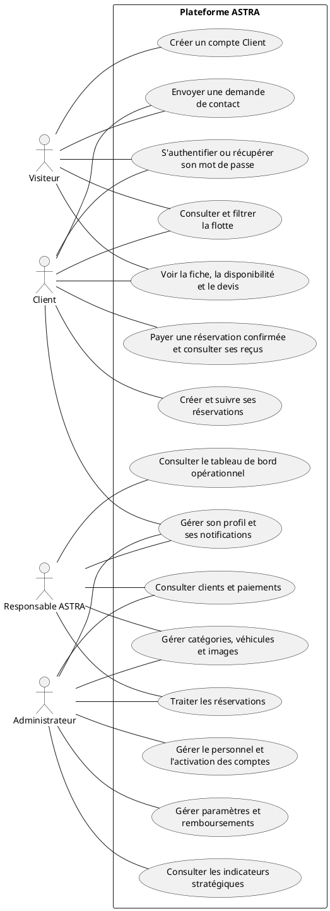
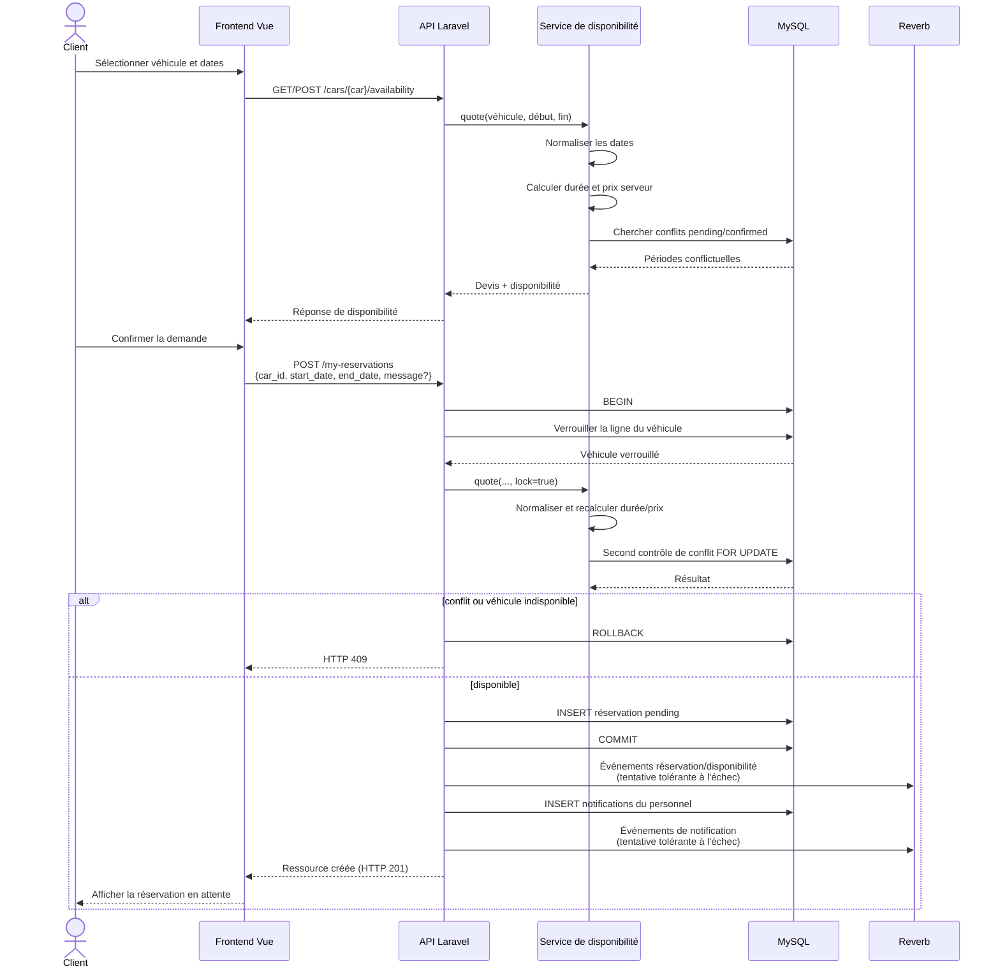
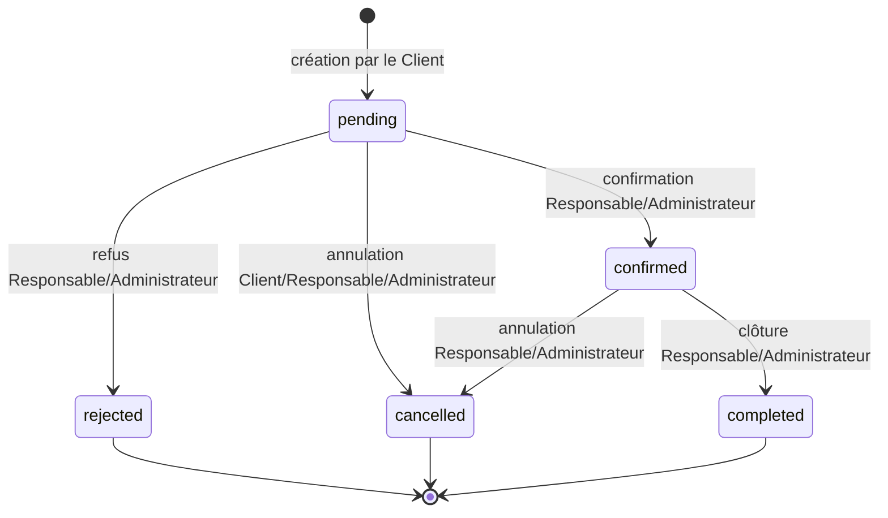
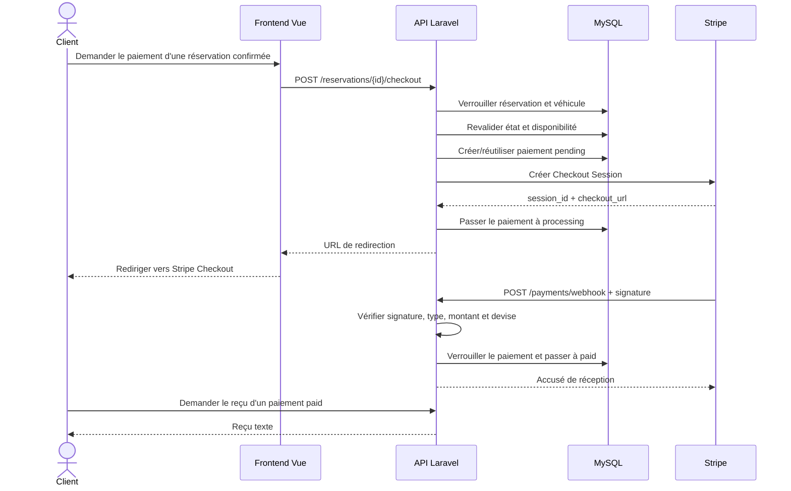
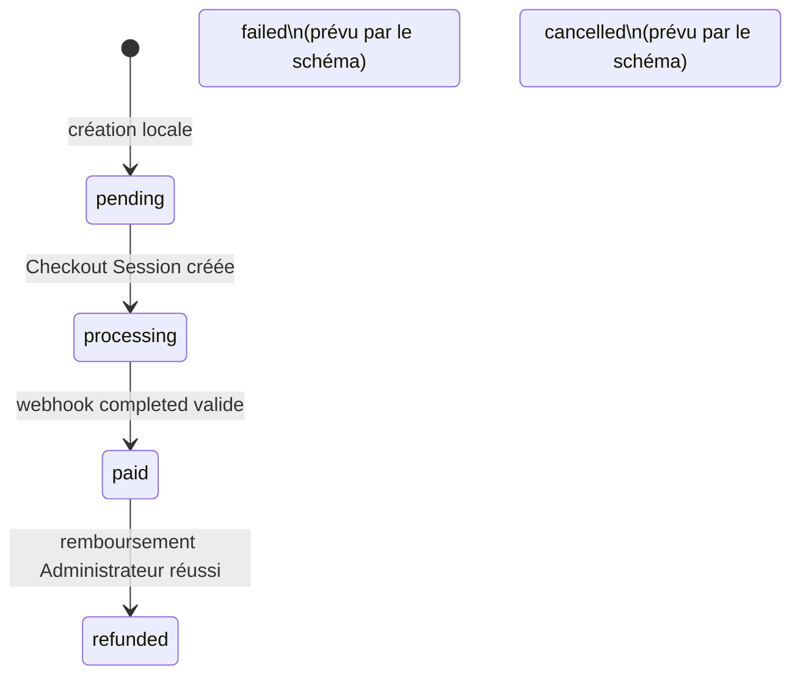

# ASTRA PFA — Preuves UML finales

## 1. Acteurs et cas d'utilisation vérifiés

Les acteurs sont **Visiteur**, **Client**, **Responsable ASTRA** et **Administrateur**. `owner` est le code du rôle Responsable ASTRA ; il ne doit apparaître qu'une fois entre parenthèses lors de la définition technique du rôle.

### 1.1 Matrice acteur–cas d'utilisation

| Cas d'utilisation prouvé | Visiteur | Client | Responsable ASTRA | Administrateur | Preuve principale |
|---|:---:|:---:|:---:|:---:|---|
| Consulter, rechercher, filtrer et trier la flotte active | ✓ | ✓ | ✓ | ✓ | Routes publiques `cars`, `categories` ; contrôleur catalogue |
| Consulter une fiche, les indisponibilités et un devis | ✓ | ✓ | ✓ | ✓ | `cars/{car}`, `availability`, `unavailable-periods` |
| S'inscrire avec le rôle Client imposé | ✓ | — | — | — | `POST /register`, `RegisterRequest`, `AuthController::register()` |
| Se connecter et récupérer/réinitialiser le mot de passe | ✓ | ✓ | ✓ | ✓ | Routes publiques d'authentification |
| Envoyer une demande de contact | ✓ | ✓ | ✓ | ✓ | `POST /contact` |
| Se connecter avec Google si la configuration existe | ✓ | ✓ | ✓ | ✓ | Routes OAuth et contrôle de configuration ; flux réel non validé |
| Gérer son profil, mot de passe, avatar et préférences | — | ✓ | ✓ | ✓ | Groupe `auth:sanctum` commun |
| Consulter et lire ses notifications | — | ✓ | ✓ | ✓ | Routes `notifications` authentifiées |
| Créer, consulter et annuler sa propre demande en attente | — | ✓ | — | — | Groupe `role:client`, `ReservationController` |
| Initier le paiement d'une réservation confirmée et consulter ses paiements/reçus | — | ✓ | — | — | Routes Client de paiement ; reçu limité à l'état `paid` |
| Gérer catégories, véhicules et images | — | — | ✓ | ✓ | Groupes préfixés `owner` et `admin` |
| Traiter les réservations | — | — | ✓ | ✓ | Confirmation, refus, annulation et clôture selon l'état courant |
| Consulter clients et paiements | — | — | ✓ | ✓ | Routes partagées Responsable/Administrateur |
| Consulter le tableau de bord opérationnel | — | — | ✓ | — | `owner/dashboard` |
| Gérer le personnel et l'activation des comptes | — | — | — | ✓ | Bloc conditionnel `admin` |
| Gérer les paramètres, vérifier l'état du fournisseur et rembourser | — | — | — | ✓ | Routes `admin/settings*` et `admin/payments/{payment}/refund` |
| Consulter les indicateurs stratégiques | — | — | — | ✓ | `admin/dashboard` |

La présence d'une capacité publique dans une session authentifiée ne constitue pas une permission spéciale : les routes du catalogue et du contact restent publiques. Le diagramme ci-dessous conserve des associations simples et n'introduit ni `include`, ni `extend`, ni généralisation non prouvée.

### 1.2 Diagramme de cas d'utilisation prêt à rendre

**Légende recommandée :** *Figure 2.1 — Cas d'utilisation principaux de la plateforme ASTRA.*

**Source recommandée :** *Source : élaborée par l'auteur à partir de `routes/api.php`, des middlewares de rôle et des contrôleurs d'ASTRA.*

### 1.3 Corrections du rapport

- Conserver ce diagramme en section 2.2 et supprimer la figure 1.1 identique.
- Employer partout **Responsable ASTRA** ; réserver `owner` à la mention technique initiale.
- Présenter Google OAuth comme une option conditionnée par la configuration, sans affirmer qu'une connexion réelle a été validée.
- Ne pas ajouter de flèches orientées entre acteur et cas d'utilisation. Les routes prouvent des associations, pas des relations UML `include` ou `extend`.

## 2. Séquence réelle de création d'une réservation

### 2.1 Ordre vérifié

1. Le Client sélectionne un véhicule et une période dans l'interface Vue.
2. Vue demande un devis de disponibilité par `GET` ou `POST /api/cars/{car}/availability`.
3. Laravel appelle `CarAvailabilityService::quote()`.
4. Le service normalise les dates dans le fuseau `Africa/Casablanca`, calcule la durée et le montant à partir de `cars.daily_price`, puis recherche dans MySQL les chevauchements en états `pending` ou `confirmed`.
5. Laravel renvoie à Vue le devis et le booléen de disponibilité.
6. Après confirmation par le Client, Vue envoie `POST /api/my-reservations` avec le véhicule, les dates et un message éventuel ; aucun prix client n'est accepté.
7. Laravel ouvre une transaction MySQL, verrouille la ligne du véhicule avec `lockForUpdate()`, puis rappelle `quote(..., lock: true)`.
8. Le service normalise de nouveau les dates, recalcule durée et prix côté serveur, et exécute le second contrôle de conflit sous verrou.
9. En cas de conflit, la transaction est annulée et l'API répond `409`. Sinon, la réservation est insérée avec l'état `pending`, puis la transaction est validée.
10. Après la validation, Laravel tente les événements de réservation et de disponibilité, crée les notifications du personnel, puis tente leurs événements temps réel. Ces émissions sont protégées par `rescue()` et ne remettent pas en cause l'écriture métier.
11. Laravel renvoie ensuite la ressource créée à Vue.

L'ordre réel dans `quote()` est **normalisation → durée/prix → recherche des conflits**. Le texte actuel du rapport place la recherche des conflits avant le calcul ; il doit être aligné sur le service. De même, la réponse HTTP vient après les événements et notifications dans le contrôleur actuel.

### 2.2 Diagramme de séquence vérifié

**Légende recommandée :** *Figure 2.5 — Séquence vérifiée de création d'une réservation avec contrôle initial et contrôle transactionnel.*

**Source recommandée :** *Source : élaborée par l'auteur à partir de `CarAvailabilityService`, `ReservationController` et `NotificationService`.*

## 3. Machine à états des réservations

| État source | Transitions autorisées | Bloque la période ? |
|---|---|:---:|
| `pending` — en attente | `confirmed`, `rejected`, `cancelled` | Oui |
| `confirmed` — confirmée | `cancelled`, `completed` | Oui |
| `rejected` — refusée | aucune | Non |
| `cancelled` — annulée | aucune | Non |
| `completed` — terminée | aucune | Non |

Lors d'une confirmation, `ReservationStatusService` verrouille la réservation, verrouille le véhicule et répète le contrôle de chevauchement en ignorant la réservation courante. Toute transition absente de la table est rejetée avec un statut HTTP `422`.

**Légende recommandée :** *Figure 2.6 — Machine à états vérifiée d'une réservation ASTRA.*

**Source recommandée :** *Source : élaborée par l'auteur à partir de `ReservationStatusService` et `CarAvailabilityService::BLOCKING_STATUSES`.*

## 4. Paiement : modèle prouvé et niveau de maturité

### 4.1 Séquence nominale implémentée

**Légende recommandée :** *Figure 2.7 — Séquence nominale du paiement Stripe prévue par l'implémentation ASTRA.*

**Source recommandée :** *Source : élaborée par l'auteur à partir de `PaymentService`, `StripePaymentGateway` et `PaymentController` ; flux réel Stripe non validé.*

### 4.2 États du schéma et transitions réellement traitées

| État | Présent dans l'enum SQL | Produit/traité par le code courant | Observation |
|---|:---:|:---:|---|
| `pending` | Oui | Oui | Créé localement avant l'appel au fournisseur. |
| `processing` | Oui | Oui | Enregistré après création de la Checkout Session. |
| `paid` | Oui | Oui | Enregistré après webhook signé `checkout.session.completed` et contrôle montant/devise. |
| `refunded` | Oui | Oui | Accessible uniquement depuis `paid`, après réussite du remboursement fournisseur demandé par l'Administrateur. |
| `failed` | Oui | Non | Aucun chemin courant n'écrit cet état. |
| `cancelled` | Oui | Non | Aucun événement d'expiration/annulation Stripe n'est traité. |

**Limite de transition :** le chemin nominal est `processing → paid`, car seul un paiement associé à une session Checkout doit recevoir le webhook. Le service vérifie la session, la signature, le type, le montant et la devise, mais ne vérifie pas explicitement que l'état précédent vaut `processing` ; tout paiement non déjà `paid` trouvé par `provider_session_id` peut être mis à `paid` après un événement valide. Cette garde d'état reste une amélioration possible.

**Limite de maturité :** le schéma, l'adaptateur Stripe, la vérification de signature et les transitions nominales existent, et les tests utilisent des doubles. Les variables Stripe n'étaient pas configurées lors de l'audit ; aucune Checkout Session, aucun webhook et aucun remboursement réels n'ont été validés. Le rapport doit employer « implémenté et testé avec doubles » ou « prévu par l'architecture », jamais « paiement Stripe opérationnel en conditions réelles ».

**Légende recommandée :** *Figure 2.8 — États de paiement définis et transitions effectivement prises en charge dans ASTRA.*

**Source recommandée :** *Source : élaborée par l'auteur à partir de la migration des paiements et de `PaymentService`.*

## 5. Corrections UML requises dans le rapport

| Emplacement | Problème actuel | Correction exacte | Preuve |
|---|---|---|---|
| Figures 1.1 et 2.1 | Même représentation répétée ; cas trop simplifiés | Supprimer la figure 1.1 et remplacer la figure 2.1 par le diagramme vérifié de ce document | Routes et contrôleurs par rôle |
| Figure 2.4 actuelle | Le texte indique conflits puis calcul, alors que `quote()` calcule durée/prix avant d'interroger les conflits ; réponse placée trop tôt | Utiliser la séquence vérifiée et renuméroter en figure 2.5 après insertion du MLD | `CarAvailabilityService::quote()`, `ReservationController::store()` |
| Figure 2.5 actuelle | Les transitions doivent être exhaustives et les états bloquants visibles | Utiliser la machine à états vérifiée et renuméroter en figure 2.6 | `ReservationStatusService::$allowed`, `BLOCKING_STATUSES` |
| Figure 2.6 actuelle | Un flux Stripe prévu peut être lu comme une validation réelle | Conserver la qualification « prévue par l'implémentation » et la source précisant que le flux réel n'est pas validé | `PaymentService`, configuration absente lors de l'audit |
| Figure 2.7 actuelle | Mélange états SQL et états réellement pilotés | Remplacer par le diagramme à quatre transitions ; laisser `failed` et `cancelled` isolés et explicitement qualifiés | Enum de migration et écritures de `PaymentService` |
